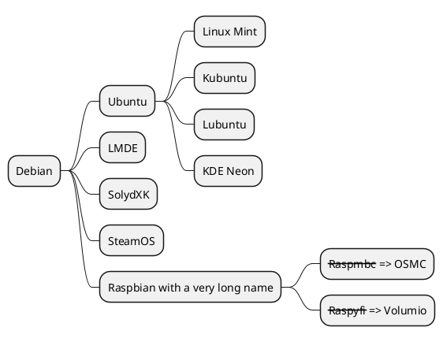

import ParrafoCopado from '../../components/parrafocopado';

 
# Welcome to my MDX page!
 
This is some **bold** and _italics_ text.
 
This is a list in markdown:
 
- One
- Two
- Three

This is some code

~~~js
const mifun= () => console.log(`
	arrow functions are cool
	${agree}
`);
~~~
 
Checkout my React component:
<ParrafoCopado size="big" color="red">
	Este es un parrafo copado
</ParrafoCopado>

## Ejemplo uml

```plantuml Your title
class SimplePlantUMLPlugin {
    + transform(syntaxTree: AST): AST
}
```

una secuencia

```plantuml Mi sequencia

skinparam backgroundColor transparent

!pragma useVerticalIf on
start
if (condition A) then (yes)
  :Text 1;
elseif (condition B) then (yes)
  :Text 2;
  stop
elseif (condition C) then (yes)
  :Text 3;
elseif (condition D) then (yes)
  :Text 4;
else (nothing)
  :Text else;
endif
stop
```

Tenemos mindmaps


¿Puedo seguir con markdown?
