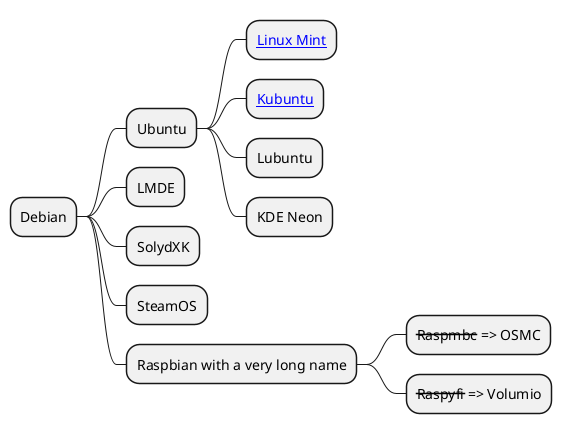

import ParrafoCopado from '@/components/parrafocopado';
import {Plot} from '@/components/plot';
import {PlotUrl} from '@/components/plot-url';
import ej_data from './ej_data.json';

import { LoremIpsum } from "lorem-ipsum"; 


# Welcome to my MDX page!
 
This is some **bold** and _italics_ text.
 
This is a list in markdown:
 
- One
- Two
- Three

This is some code

~~~js
const mifun= () => console.log(`
	arrow functions are cool
	${agree}
`);
~~~
 
Checkout my React component:
<ParrafoCopado size="big" color="red">
	Este es un parrafo copado
</ParrafoCopado>

{new LoremIpsum().generateParagraphs(2)}

## Ejemplo uml

```plantuml Your title
class SimplePlantUMLPlugin {
    + transform(syntaxTree: AST): AST
}
```

una secuencia

```plantuml Mi sequencia

skinparam backgroundColor transparent

!pragma useVerticalIf on
start
if (condition A) then (yes)
  :Text 1;
elseif (condition B) then (yes)
  :Text 2;
  stop
elseif (condition C) then (yes)
  :Text 3;
elseif (condition D) then (yes)
  :Text 4;
else (nothing)
  :Text else;
endif
stop
```

Tenemos mindmaps


## Detalle Kubuntu

<Plot

data={[
	{
		x: [1, 2, 3],
	 	y: [2, 6, 3],
	 	type: 'scatter',
	 	mode: 'lines+markers',
	 	marker: {color: 'red'},
	},
	{type: 'bar', x: [1, 2, 3], y: [2, 5, 3]},
]}

layout={ {width: 320, height: 240, title: 'A Fancy Plot'} }

/>

## Este plot lee datos de un archivo

<Plot data={ ej_data } layout={ {title: 'eg loaded from json file'} }/>

## Este plot lee datos de una url

<PlotUrl url= { __dirname+'/ej_data.json' } />

## Este plot lee datos de la web


<PlotUrl 
	url="https://data.podemosaprender.org/finanzas/USD_BLUE_2023.csv"
	opts={ {delimiter: '\t'} }
	dataFun={ (d) => [{x: d.fecha, y: d.venta, type: 'line',}] }
/>
